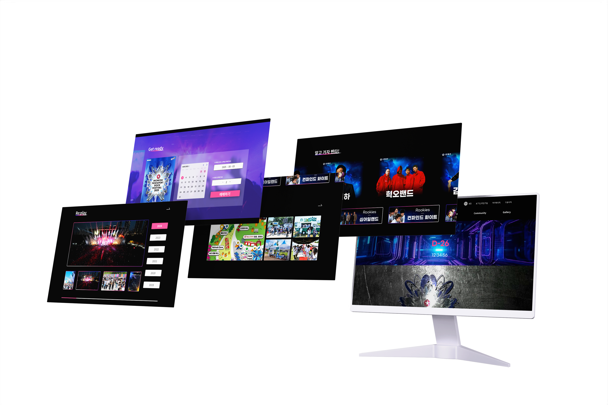
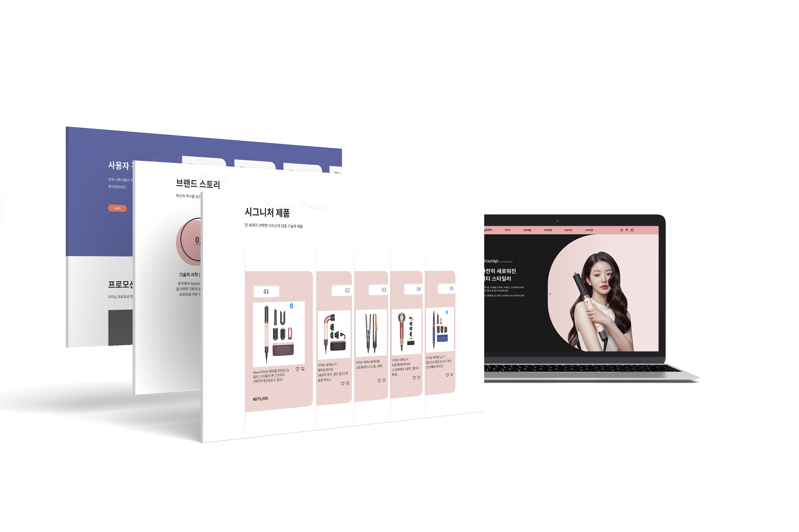
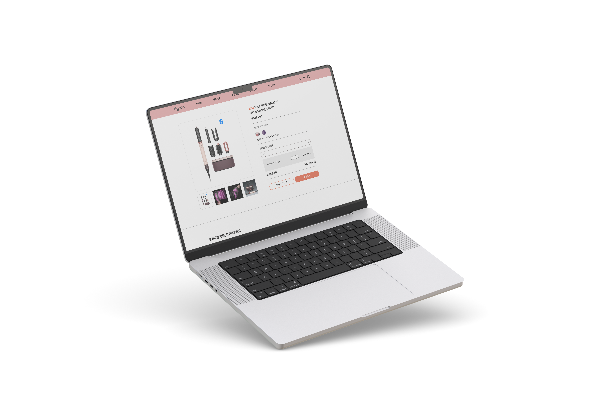

# 👋 About Me
안녕하세요! 저는 웹디자인과 퍼블리싱을 배우고 있는 **이유진**입니다.  
사용자가 보기 쉽고 편리한 웹사이트를 제작하는 것을 목표로 하며,  
기획부터 디자인, 퍼블리싱까지 직접 작업한 프로젝트를 통해 성장하고 있습니다.  

---

## 💡 Skills

| 분야 | 스킬 |
|-----|------|
| **Design** | Figma, Photoshop, Illustrator |
| **Frontend** | HTML5, CSS3, JavaScript, jQuery |
| **Tools** | VS Code, GitHub, Notion, Slack |
| **Etc.** | 반응형 레이아웃, 웹 접근성 고려, 크로스브라우징 테스트 |

---

# 💼 Projects

## 1️⃣ Project 01 : 인천펜타포트락페스티벌 반응형 웹사이트
> 반응형 웹사이트 리뉴얼 프로젝트

**📆 제작 기간** : 2025.06.01 ~ 2025.07.30
**🧑 역할** : 기획50% , 디자인 100%, 퍼블리싱 100% 

### ⭐ 프로젝트 설명
단순화되어 있던 기존사이트를 보다 편리하게 사용가능 하도록
주요기능과 핵심정보를 추가하여 리뉴얼한 프로젝트 입니다.

- 메인컬러 : 일렉트릭 퍼플 + 핫핑크 + 미드나잇 블루 + 페일 그레이

- 메인페이지 + 예약 및 예매창 + 공지사항 페이지 제작 + 구글지도 연동 

### 🚀 링크
- [무드보드](https://www.figma.com/proto/YXgLbo9G55u14hgSPqYRKF/-%EA%B7%B8%EB%A6%B0%EC%95%84%ED%8A%B8-%EC%9D%B8%EC%B2%9C%ED%8E%9C%ED%83%80%ED%8F%AC%ED%8A%B8%EB%9D%BD%ED%8E%98%EC%8A%A4%ED%8B%B0%EB%B2%8C_%ED%94%84%EB%A1%9C%EC%A0%9D%ED%8A%B81?node-id=39-25&t=2VvaSvF339vuLiNH-1)
- [인포메이션 아키텍쳐](https://www.figma.com/proto/YXgLbo9G55u14hgSPqYRKF/-%EA%B7%B8%EB%A6%B0%EC%95%84%ED%8A%B8-%EC%9D%B8%EC%B2%9C%ED%8E%9C%ED%83%80%ED%8F%AC%ED%8A%B8%EB%9D%BD%ED%8E%98%EC%8A%A4%ED%8B%B0%EB%B2%8C_%ED%94%84%EB%A1%9C%EC%A0%9D%ED%8A%B81?node-id=670-428&t=2VvaSvF339vuLiNH-1)
- [플로우차트](https://www.figma.com/proto/YXgLbo9G55u14hgSPqYRKF/-%EA%B7%B8%EB%A6%B0%EC%95%84%ED%8A%B8-%EC%9D%B8%EC%B2%9C%ED%8E%9C%ED%83%80%ED%8F%AC%ED%8A%B8%EB%9D%BD%ED%8E%98%EC%8A%A4%ED%8B%B0%EB%B2%8C_%ED%94%84%EB%A1%9C%EC%A0%9D%ED%8A%B81?node-id=216-517&t=2VvaSvF339vuLiNH-1)
- [와이어프레임](https://www.figma.com/proto/YXgLbo9G55u14hgSPqYRKF/-%EA%B7%B8%EB%A6%B0%EC%95%84%ED%8A%B8-%EC%9D%B8%EC%B2%9C%ED%8E%9C%ED%83%80%ED%8F%AC%ED%8A%B8%EB%9D%BD%ED%8E%98%EC%8A%A4%ED%8B%B0%EB%B2%8C_%ED%94%84%EB%A1%9C%EC%A0%9D%ED%8A%B81?node-id=254-1059&t=2VvaSvF339vuLiNH-1)
- [디자인](https://www.figma.com/proto/YXgLbo9G55u14hgSPqYRKF/-%EA%B7%B8%EB%A6%B0%EC%95%84%ED%8A%B8-%EC%9D%B8%EC%B2%9C%ED%8E%9C%ED%83%80%ED%8F%AC%ED%8A%B8%EB%9D%BD%ED%8E%98%EC%8A%A4%ED%8B%B0%EB%B2%8C_%ED%94%84%EB%A1%9C%EC%A0%9D%ED%8A%B81?node-id=393-1107&t=2VvaSvF339vuLiNH-1)
- [코드 저장소](https://github.com/YJ0201/portfolio2025/tree/main/project001)
- [배포 사이트](https://yj0201.github.io/portfolio2025/project001/layout.html)

### 👀 페이지 미리보기
| 메인 | 서브 | |
|-----|------|--|
|  |

---

## 2️⃣ Project 02 : 다이슨 헤어케어 웹사이트
> 제품형 웹페이지 리뉴얼프로젝트

**📆 제작 기간** : 2025.08.01 ~ 2025.08.30  
**🧑 역할** : 기획 100%, 디자인 100%, 퍼블리싱 100%

### ⭐ 프로젝트 설명
다이슨(Dyson)의 헤어케어 제품을 중심으로 한 브랜드 웹사이트를 제작하였습니다.
브랜드의 고유한 아이덴티티를 웹사이트 전반에 녹여내기 위해 다이슨의 핵심 컨셉과 색상을 적극적으로 활용하였으며,
이를 통해 사용자에게 일관된 브랜드 경험을 제공하고자 하였습니다. 또한 사용자 편의성을 고려해 장바구니 기능을 추가함으로써,
제품 탐색에서 구매까지의 흐름이 자연스럽고 효율적으로 이어질 수 있도록 설계하였습니다.
브랜드의 정체성을 시각적으로 강화하면서도 실제 사용성을 고려한 UI/UX 구현에 중점을 둔 프로젝트입니다.

- **Swiper** 슬라이드, **탭메뉴**, 제품상세페이지(서브), 로그인페이지, 장바구니 기능 구현

### 🚀 링크
- [무드보드](https://www.figma.com/proto/oO8yfyEfvP0VJYAikoJGLl/-%EA%B7%B8%EB%A6%B0%EC%95%84%ED%8A%B8-%EB%8B%A4%EC%9D%B4%EC%8A%A8_%ED%94%84%EB%A1%9C%EC%A0%9D%ED%8A%B82?node-id=28-7&t=IUIBkvGtfckz9jJ7-1)
- [와이어프레임](https://www.figma.com/proto/oO8yfyEfvP0VJYAikoJGLl/-%EA%B7%B8%EB%A6%B0%EC%95%84%ED%8A%B8-%EB%8B%A4%EC%9D%B4%EC%8A%A8_%ED%94%84%EB%A1%9C%EC%A0%9D%ED%8A%B82?node-id=106-102&t=IUIBkvGtfckz9jJ7-1)
- [디자인 시안(메인)](https://www.figma.com/proto/oO8yfyEfvP0VJYAikoJGLl/-%EA%B7%B8%EB%A6%B0%EC%95%84%ED%8A%B8-%EB%8B%A4%EC%9D%B4%EC%8A%A8_%ED%94%84%EB%A1%9C%EC%A0%9D%ED%8A%B82?node-id=537-112&t=IUIBkvGtfckz9jJ7-1)
- [디자인 시안(서브)](https://www.figma.com/proto/oO8yfyEfvP0VJYAikoJGLl/-%EA%B7%B8%EB%A6%B0%EC%95%84%ED%8A%B8-%EB%8B%A4%EC%9D%B4%EC%8A%A8_%ED%94%84%EB%A1%9C%EC%A0%9D%ED%8A%B82?node-id=1-4&t=IUIBkvGtfckz9jJ7-1)
- [코드 저장소](https://github.com/YJ0201/portfolio2025/tree/main/project002)
- [배포 사이트](https://yj0201.github.io/portfolio2025/project002/)

### 👀 페이지 미리보기
| 메인 페이지 | 상품 상세 페이지 |
|------------|----------------|
|  |  |

---

## 3️⃣ Project 03 : pixar's UP 웹사이트 
> 영화 소개 포트폴리오 웹사이트 제작

**📆 제작 기간** : 2025.09.06 ~ 2025.09.26
**🧑 역할** : 기획 100%, 디자인 100%, 퍼블리싱 100%

### ⭐ 프로젝트 설명
다양한 인터랙션 구현과 영화의 아이덴티티,
컨셉컬러를 기반으로 웹사이트를 제작하였습니다.

- **One Page Scroll** 구조

### 🚀 링크
- [디자인 시안](https://www.figma.com/proto/561zaSyv2LPGIUoeyut8Go/-%EA%B7%B8%EB%A6%B0%EC%95%84%ED%8A%B8-PIXAR_UP_%ED%94%84%EB%A1%9C%EC%A0%9D%ED%8A%B83?node-id=200-593&t=BmWGQ0i2ngzcwSNb-1)
- [코드 저장소](https://github.com/YJ0201/portfolio2025/tree/main/project003)
- [배포사이트](https://yj0201.github.io/portfolio2025/project003/)

### 👀 페이지 미리보기
| 메인 섹션 | 상세 섹션 |
|----------|-----------|
|  | 

---

## 🎯 배운 점 & 성장 포인트
- HTML/CSS의 시멘틱 마크업과 유지보수성을 고려한 코드 작성법 습득
- 협업을 위한 Git/GitHub 브랜치 관리 경험
- 사용자 경험(UX)을 고려한 디자인 사고 확립
- 문제 해결 능력과 디버깅 스킬 향상
